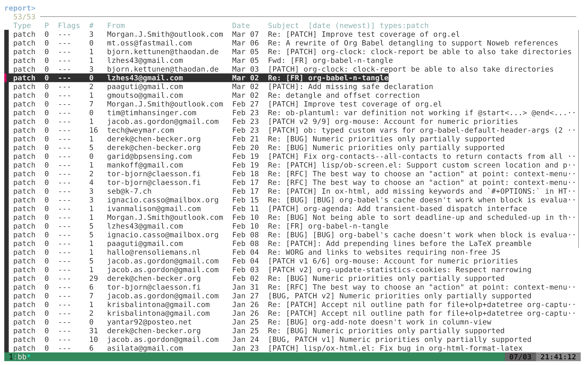

#+title: 🦴 BONE — BARK's Own Nifty Explorer
#+author: Bastien Guerry

*bone* (what you get when you stop barking) is a standalone [[https://github.com/babashka/babashka][Babashka]]
script for browsing [[https://codeberg.org/bzg/bark][BARK]] reports. When [[https://github.com/junegunn/fzf][fzf]] is available, bone lets you
browse BARK reports interactively.

* Install

Assuming [[https://github.com/babashka/bbin][bbin]] is installed:

: bbin install io.github.bzg/bone

* Configure

Create =~/.config/bone/config.edn=:

#+begin_src clojure
{:email        "you@example.com"
 :text-browser "w3m"          ;; "w3m", "lynx" or "links"
 :diff-pager   "delta"        ;; "delta", "bat" or "diff-so-fancy"
 }
#+end_src

- =:email= — your email address, used by =-m= to filter reports involving you.
- =:text-browser= — terminal browser for viewing reports on =RET=.  When unset, bone probes for =w3m=, =lynx=, =links=, then falls back to =xdg-open=.
- =:diff-pager= — pager for viewing patches on =C-p=.  When unset, bone probes for =delta=, =bat=, then falls back to =$PAGER= or =less=.

* Usage

: bone [options]
: bone clear
: bone update

** Options

| Option               | Description                                      |
|----------------------+--------------------------------------------------|
| =-f=, =--file FILE=      | Read reports from a JSON file                    |
| =-u=, =--url URL=        | Fetch reports from a URL                         |
| =-U=, =--urls-file FILE= | Fetch and merge from URLs listed in FILE         |
| =-e=, =--email EMAIL=    | Your email (overrides config)                    |
| =-n=, =--source NAME=    | Filter by source name                            |
| =-p=, =--min-priority N= | Only show reports with priority >= N (1, 2 or 3) |
| =-s=, =--min-status N=   | Only show reports with status >= N (1–7)         |
| =-m=, =--mine=           | Show only reports involving your email           |
| =-c=, =--closed=         | Include closed reports                           |
| =-=                    | Read JSON from stdin                             |

** Source management

| Command                      | Description               |
|------------------------------+---------------------------|
| =-a=, =--add-source URL_OR_PATH= | Add a reports.json source |
| =--remove-source URL_OR_PATH=  | Remove a source           |
| =--list-sources=               | List configured sources   |

Sources are stored in =~/.config/bone/sources.json=.

** Cache management

| Command | Description                           |
|---------+---------------------------------------|
| =clear=   | Empty the cache                       |
| =update=  | Fetch/update reports from all sources |

By default, bone reads cached reports if available.  If no cache
exists, it fetches from sources once and caches the result.  Use
=bone update= to refresh.

** Interactive keys (fzf)

| Key | Action                          |
|-----+---------------------------------|
| =RET= | View report in terminal browser |
| =C-o= | Open report in system browser   |
| =C-p= | View patch (fetched to cache)   |
| =C-s= | Change sort order               |
| =C-t= | Filter by report type           |
| =C-n= | Filter by source                |

* Examples

Browse your reports from a local file:

: bone -f reports.json -m

Browse all reports from a remote URL:

: bone -u https://example.com/reports.json

Merge reports from multiple BARK instances:

: bone -U my-urls.txt

The URLs file (=-U=) lists one URL per line; blank lines and =#=
comments are ignored.

Add a source and browse:

: bone -a https://example.com/reports.json
: bone

Update cached reports and browse only yours:

: bone update
: bone -m

* Files

| Path                          | Purpose                   |
|-------------------------------+---------------------------|
| =~/.config/bone/config.edn=     | User configuration        |
| =~/.config/bone/sources.json=   | Registered report sources |
| =~/.config/bone/cache/patches/= | Cached patches            |
| =~/.config/bone/cache/reports/= | Cached reports.json files |

* License

Copyright © 2026 Bastien Guerry

Distributed under the [[https://www.eclipse.org/legal/epl-2.0/][Eclipse Public License 2.0]].
